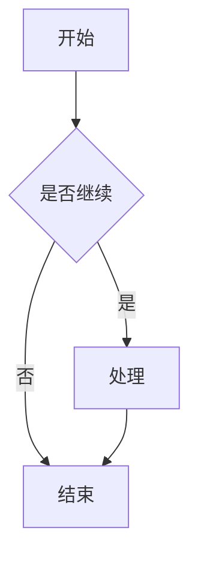
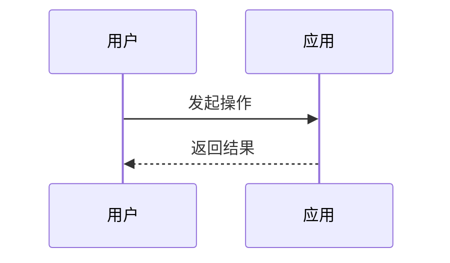
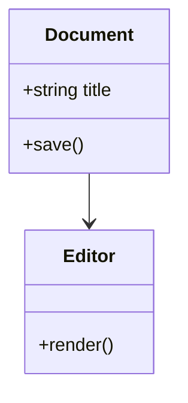
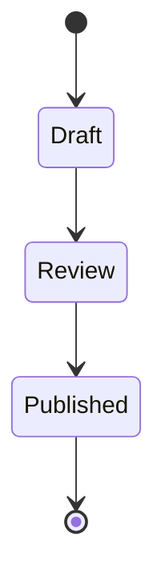
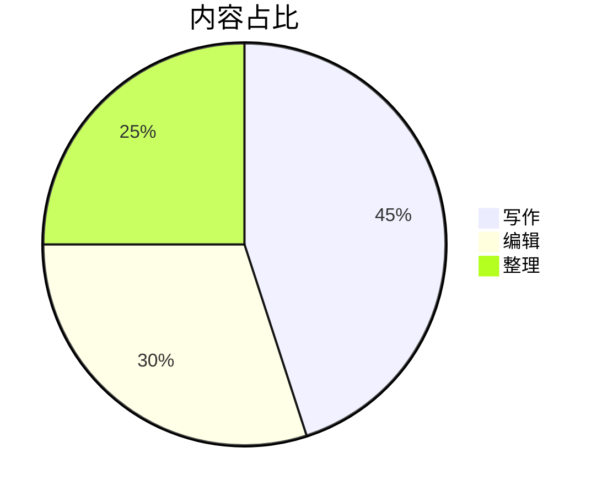
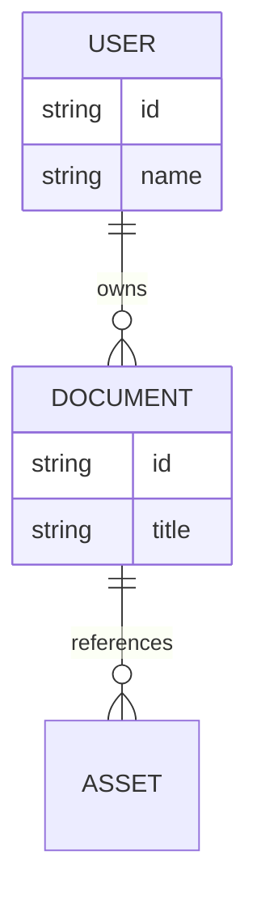

<!-- markdownlint-disable-next-line MD025 -->
# Nomo Markdown 全元素实例

这份文档用于在 Nomo 中验收 **Markdown-first** 的编辑体验：同一份 `.md` 文本既能在语义编辑中直接操作标题、列表、表格、代码、公式和图表，也能在源码模式中保持可读、可迁移、可手工维护。

它不是功能清单的堆叠，而是一份可打开、可编辑、可保存的样例文档。阅读时可以按节点逐段检查：每个节点都包含示例、保存形式、插入入口、编辑交互和常用快捷键。首次运行打开的是安装资源，建议先使用“另存为”复制到自己的目录，再进行修改练习。

## Front matter 元数据

文档开头的 YAML front matter 会被 Nomo 保留，用来描述标题、作者、标签等元信息。它属于文档元数据，不是正文语义节点，也不参与正文目录。

| 操作项 | 说明 |
| :--- | :--- |
| 保存形式 | 文档最开头由 `---` 包裹的 YAML 块 |
| 插入 / 转换 | 段落菜单的“文档元数据”；也可在源码模式手写 YAML front matter |
| 编辑交互 | 摘要卡展示 title、status、created、updated、tags；点击卡片可编辑原始 YAML、查看解析警告或确认删除，且不会把元数据当作普通正文、标题或代码块处理 |
| 常用快捷键 | 无 |

## 正文目录节点

<!-- toc -->
- [Nomo Markdown 全元素实例](#nomo-markdown-全元素实例)
  - [Front matter 元数据](#front-matter-元数据)
  - [正文目录节点](#正文目录节点)
  - [标题节点](#标题节点)
    - [三级标题示例](#三级标题示例)
      - [四级标题示例](#四级标题示例)
        - [五级标题示例](#五级标题示例)
          - [六级标题示例](#六级标题示例)
  - [段落与行内标记](#段落与行内标记)
  - [链接导航节点](#链接导航节点)
  - [列表节点](#列表节点)
  - [引用与提示块节点](#引用与提示块节点)
  - [表格节点](#表格节点)
  - [代码块节点](#代码块节点)
  - [数学公式节点](#数学公式节点)
  - [Mermaid 图表节点](#mermaid-图表节点)
  - [图片节点](#图片节点)
  - [HTML 与注释节点](#html-与注释节点)
  - [脚注节点](#脚注节点)
  - [水平分割线节点](#水平分割线节点)
  - [应用级操作速查](#应用级操作速查)
    - [五分钟上手验收](#五分钟上手验收)
    - [文件夹标签页与恢复](#文件夹标签页与恢复)
    - [查找导航与统计](#查找导航与统计)
    - [视图窗口与设置](#视图窗口与设置)
    - [TXT 与 JSON 大文件和编码](#txt-与-json-大文件和编码)
    - [剪贴板图片与右键菜单](#剪贴板图片与右键菜单)
    - [格式检查导出与平台](#格式检查导出与平台)
<!-- /toc -->

正文 TOC 块由独占行 `<!-- toc -->` 和 `<!-- /toc -->` 包裹，中间目录项从当前 Markdown 标题派生。它不是普通 Markdown 注释，也不同于侧边的 Outline；它是正文中的导航节点，保存时仍保留为 Markdown 文本。

```md
<!-- toc -->
...目录项由标题生成...
<!-- /toc -->
```

| 操作项 | 说明 |
| :--- | :--- |
| 保存形式 | `<!-- toc -->` 与 `<!-- /toc -->` 包裹的 Markdown 列表 |
| 插入 / 转换 | 段落菜单或工具栏“正文目录”按钮 |
| 编辑交互 | 目录块自身不可直接编辑；点击目录项跳转到对应标题；目录块上的删除按钮可移除目录 |
| 常用快捷键 | 无 |

## 标题节点

### 三级标题示例

#### 四级标题示例

##### 五级标题示例

###### 六级标题示例

本文标题“Nomo Markdown 全元素实例”是一级标题，当前“标题节点”是二级标题，上方继续展示了三级到六级标题。这样既覆盖 H1～H6，也让文档保持唯一一级标题。

标题用于组织长文档结构。Nomo 会从标题派生 Outline 和正文 TOC 块，因此标题层级应表达内容结构，而不是只用来放大文字。大纲标题行支持折叠与整节拖拽；拖到目标标题之前、内部或之后时，会连同子章节一起移动，并自动调整标题层级。重排可以撤销，只读文档不会被修改。

| 操作项 | 说明 |
| :--- | :--- |
| 保存形式 | `#` 到 `######` |
| 插入 / 转换 | 段落菜单的标题子菜单；工具栏标题按钮；源码模式输入 `# ` 到 `###### ` |
| 编辑交互 | 可提升或降低标题层级；参与 Outline 和正文 TOC 块；可在大纲中折叠、定位或拖拽整个章节 |
| 常用快捷键 | `Ctrl + 1` 到 `Ctrl + 6`、`Ctrl + =`、`Ctrl + -` |

## 段落与行内标记

普通段落用于承载正文。行内标记适合表达局部语义：**加粗** 表示强调，*斜体* 表示轻强调，~~删除线~~ 表示废弃内容，<u>下划线</u> 表示额外标记，<mark>高亮</mark> 表示重点，`行内代码` 表示代码片段，$x + y = z$ 表示行内公式，[带标题的链接](https://example.com/docs "文档入口") 表示外部引用。

HTML 行内标签示例：<strong>strong</strong>、<em>em</em>、<u>u</u>、<s>s</s>、<del>del</del>、<code>code</code>、<a href="https://example.com" title="HTML 链接">HTML a 标签</a>。这些安全 HTML 会转换为对应语义标记，保存时可能规范化为 Markdown 或安全 HTML。

相邻行内代码示例：``` alpha``beta ```。保存时会使用内部占位策略，避免两个行内代码粘在一起后无法重新解析。

行内代码渲染默认开启，可在偏好设置中关闭；关闭后语义编辑区会显示原始 Markdown 反引号写法，例如 `` `行内代码` ``。

硬换行示例：这一行末尾有一个反斜杠。\
这一行应紧跟上一行显示，但仍属于同一个段落的换行效果。

| 操作项 | 说明 |
| :--- | :--- |
| 保存形式 | 普通段落用空行分隔；行内 mark 保存为 Markdown 或安全 HTML，例如 `**加粗**`、`*斜体*`、`~~删除线~~`、`<u>下划线</u>`、`<mark>高亮</mark>`、<code>&#96;行内代码&#96;</code>、`$x$`、`[文本](地址 "标题")` |
| 插入 / 转换 | 直接输入正文；格式菜单或工具栏切换支持的行内样式；行内公式当前从源码输入 `$...$` |
| 编辑交互 | 选区上切换 mark；空光标点击格式按钮会进入待定行内格式，继续输入自动带格式；清除样式只移除行内表现，不改变标题、列表、引用、表格等块级结构 |
| 常用快捷键 | 段落 <kbd>Ctrl</kbd> + <kbd>0</kbd>；加粗 <kbd>Ctrl</kbd> + <kbd>B</kbd>；斜体 <kbd>Ctrl</kbd> + <kbd>I</kbd>；删除线 <kbd>Alt</kbd> + <kbd>Shift</kbd> + <kbd>5</kbd>；下划线 <kbd>Ctrl</kbd> + <kbd>U</kbd>；链接 <kbd>Ctrl</kbd> + <kbd>K</kbd>；行内代码 <kbd>Ctrl</kbd> + <kbd>&#96;</kbd>；清除样式 <kbd>Ctrl</kbd> + <kbd>&#92;</kbd> |

## 链接导航节点

[跳转到本文“图片节点”](#图片节点)用于验收文内锚点。相对文档链接可写成 `[回到标题节点](./sample.md#标题节点)`；它用于演示同目录文档导航，另存为并改名后请把 `sample.md` 换成实际文件名。`http` / `https` 链接交给系统浏览器，`mailto` 链接交给系统邮件应用。

下面只展示本地文档和附件的写法，不实际打开不存在的样例文件：

```md
[同目录 Markdown](./guide.md#安装)
[TXT 文档](./notes.txt)
[JSON 数据](./data/example.json)
[PDF 附件](./assets/spec.pdf)
```

| 操作项 | 说明 |
| :--- | :--- |
| 保存形式 | 标准 Markdown 链接 `[文字](目标)` |
| 打开方式 | 在语义编辑中使用 <kbd>Ctrl</kbd> / <kbd>Cmd</kbd> + 点击 |
| 支持目标 | 文内锚点、已保存文档的相对或本机绝对路径，以及 PDF、Office、CSV、常见图片附件 |
| 外部链接 | 支持 `http`、`https` 与 `mailto`，由系统默认应用打开 |
| 安全边界 | 不支持 UNC、`file://`、查询参数、目录和未列入白名单的附件类型 |

## 列表节点

- 无序列表第一项
  - 无序列表第二层
- 无序列表第二项

1. 有序列表第一项
2. 有序列表第二项
   1. 有序列表第二层
   2. 有序列表第二层继续

- [x] 已完成任务项
- [ ] 未完成任务项
- [ ] 任务列表仍是 Markdown `- [ ]` / `- [x]` 文本，不是项目管理任务。

列表适合把步骤、清单和轻量任务拆开。Task List 只是 Markdown 文本表达的轻量任务清单，不会变成 Issue、日程或项目管理对象。

| 操作项 | 无序列表 | 有序列表 | 任务列表 |
| :--- | :--- | :--- | :--- |
| 保存形式 | `-`、`*`、`+` | `1.`、`2.` | `- [ ]` / `- [x]` |
| 插入 / 转换 | 段落菜单或工具栏列表按钮；源码模式输入列表标记 | 段落菜单；源码模式输入数字列表 | 段落菜单或工具栏任务列表按钮 |
| 编辑交互 | 支持嵌套；`Tab` 缩进，`Shift + Tab` 提升层级 | 支持嵌套；序号由 Markdown 结构表达 | 点击 checkbox 可切换完成状态，本质仍保存为 Markdown 列表文本 |
| 常用快捷键 | `Ctrl + Shift + ]` | `Ctrl + Shift + [` | `Ctrl + Shift + X` |

## 引用与提示块节点

> 普通引用块用于保留引用语义。多行引用会保持在同一个引用区域。

> [!NOTE]
> 提醒：适合写一般说明。

> [!TIP]
> 建议：适合写推荐做法。

> [!IMPORTANT]
> 重要：适合写必须关注的决定。

> [!WARNING]
> 警告：适合写可能出错的场景。

> [!CAUTION]
> 风险：适合写破坏性或高风险动作。

普通引用适合引用外部文本或上下文说明。Callout 使用 GitHub Alert 语法表达语义化提示，支持 note、tip、important、warning、caution 五种固定类型。

| 操作项 | 普通引用 | Callout 提示块 |
| :--- | :--- | :--- |
| 保存形式 | 每行前缀 `>` | `> [!NOTE]`、`> [!TIP]`、`> [!IMPORTANT]`、`> [!WARNING]`、`> [!CAUTION]` |
| 插入 / 转换 | 段落菜单或工具栏引用按钮；源码模式输入 `>` | 段落菜单或工具栏提示块按钮；源码模式输入 GitHub Alert 语法 |
| 编辑交互 | 再次切换引用可取消引用包裹 | 正文区域可编辑；可切换类型或取消提示块；普通引用不会自动转换为 Callout |
| 常用快捷键 | `Ctrl + Shift + Q` | `Ctrl + Shift + A` |

## 表格节点

| 元素 | 状态 | 说明 |
| :--- | :---: | ---: |
| 基础表格 | 可编辑 | 使用 Markdown pipe table 保存 |
| 表头行 | 可切换 | 第一行可作为 header |
| 对齐 | 左 / 中 / 右 | 分隔行使用 `:---`、`:---:`、`---:` |
| 行列操作 | 可插入 / 删除 | 语义模式中显示表格内联控件 |

基础表格适合写轻量二维信息，不承担电子表格的计算、筛选或复杂布局能力。Markdown 主内容只保存 pipe table，表格内联控件只是编辑时的交互入口。

| 操作项 | 说明 |
| :--- | :--- |
| 保存形式 | Markdown pipe table |
| 插入 / 转换 | 段落菜单或工具栏表格按钮；表格尺寸选择器 |
| 编辑交互 | 光标在表格内显示内联控件；可插入 / 删除行列、设置列对齐、切换表头行、删除整表 |
| 常用快捷键 | `Ctrl + Shift + T`；表格内 `Ctrl + Enter` 插入下方行，`Ctrl + Shift + Enter` 插入上方行 |

## 代码块节点

```ts title="src/example.ts"
type MarkdownElement = {
  name: string;
  node: string;
  savedAsMarkdown: boolean;
};

const element: MarkdownElement = {
  name: '代码块',
  node: 'code_block',
  savedAsMarkdown: true,
};

console.log(element);
```

```diff title="example.diff"
- const mode = 'preview';
+ const mode = 'semantic';
+ const sourceMode = 'source';
```

```powershell title="windows-first.ps1"
$root = "D:\Demo\Nomo"
Write-Output "Nomo works in $root"
```

代码块用于保存多行源码、命令、补丁或配置片段。它仍是 fenced code block，不是可执行脚本；语义编辑中的复制按钮、语言选择器和编辑态只服务于阅读与写作。

| 操作项 | 说明 |
| :--- | :--- |
| 保存形式 | 三个反引号组成的 fenced code block，例如 <code>```ts ... ```</code> |
| 插入 / 转换 | 段落菜单或工具栏代码块按钮；源码模式输入三个反引号 |
| 编辑交互 | 点击进入编辑态；复制按钮复制代码；右下角语言选择器切换语言；失焦保存；`Esc` 放弃本次编辑 |
| 常用快捷键 | `Ctrl + Shift + K`；编辑态 `Ctrl + Enter` 保存并下插段落，`Ctrl + Shift + Enter` 保存并上插段落 |

## 数学公式节点

行内公式示例：$E = mc^2$，以及带转义美元符的公式 $price = 100\$ + fee$。

$$
\int_0^1 x^2 dx = \frac{1}{3}
$$

$$
\begin{aligned}
a^2 + b^2 &= c^2 \\
f(x) &= \sum_{n=0}^{\infty} \frac{x^n}{n!}
\end{aligned}
$$

数学公式使用 TeX 文本作为主数据，并由 KaTeX 渲染。行内公式适合嵌入句子，公式块适合展示推导过程或多行表达式。

| 操作项 | 行内公式 | 公式块 |
| :--- | :--- | :--- |
| 保存形式 | `$E = mc^2$` | `$$` 包裹的 TeX 块 |
| 插入 / 转换 | 源码模式输入 `$...$` | 段落菜单或工具栏数学公式按钮；源码模式输入 `$$` 后回车或完整公式块 |
| 编辑交互 | 点击进入单输入框编辑态；`Enter` 保存；`Esc` 放弃；边界方向键退出到节点前后 | 点击进入多行编辑态；普通 `Enter` 在公式内换行；`Esc` 放弃本次编辑 |
| 常用快捷键 | 无 | `Ctrl + Shift + M`；编辑态 `Ctrl + Enter` 保存并下插段落，`Ctrl + Shift + Enter` 保存并上插段落 |

## Mermaid 图表节点














Mermaid 图表适合技术文档中的流程、时序、状态、类关系、甘特图和 ER 图。Nomo 保存的是 fenced code block 中的 Mermaid 源码，预览只是从文本派生出来的渲染结果。

| 操作项 | 说明 |
| :--- | :--- |
| 保存形式 | Mermaid fenced code block，例如 <code>```mermaid ... ```</code> |
| 插入 / 转换 | 段落菜单图表子菜单或工具栏图表按钮；可插入空白图表，也可从流程图、时序图、类图、状态图、饼图、甘特图、ER 图模板开始 |
| 编辑交互 | 点击图表进入源码编辑态；编辑态上方写源码、下方看预览；全屏按钮可放大查看；`Esc` 关闭全屏或放弃编辑 |
| 常用快捷键 | 无 |

## 图片节点


<p align="center">
  
</p>

上方第一张图用于验收标准 Markdown 图片，第二张图用于验收带宽度和居中布局的安全 HTML。图片节点支持 `left`、`center`、`right` 对齐，以及像素或百分比宽度；带布局属性的图片在保存时会规范化为安全的 `` 或 `<p align="..."></p>` HTML。

本地图片建议使用相对路径，让 Markdown 文件和资源目录一起迁移时仍能正常显示。图片资源策略决定导入目标，但 Markdown 主内容只保存路径或 URL。

本实例的图标随安装包离线提供。将文档另存到其他目录后，如需保留该图片，请一并复制 `assets/128x128.png`，或使用 Nomo 重新插入图片。

| 操作项 | 说明 |
| :--- | :--- |
| 保存形式 | 普通图片使用 ``；对齐和宽度使用安全 HTML 保存 |
| 插入 / 转换 | 源码输入图片 Markdown；或在语义编辑空白处右键“插入 → 图像”、粘贴 / 拖放图片；本地策略要求文档先保存 |
| 编辑交互 | 双击或全屏按钮查看；右键可设置对齐、尺寸、打开所在位置、复制图片、复制路径、删除 |
| 常用快捷键 | 全屏中 `Ctrl + 滚轮` 缩放，拖动平移，`Esc` 关闭 |

## HTML 与注释节点

<section class="demo-html-block" id="editable-html-demo">
  <strong>可编辑 HTML 块：</strong>当前支持 section / div 作为块级根标签，并允许部分安全内联标签。
</section>

<!-- 块级注释：语义编辑中应显示为低调注释卡片，保存时仍保留 Markdown 注释语义。 -->

正文前半句 <!-- 行内注释：只给作者看的补充 --> 正文后半句。这一行用于验收行内注释标签和前后文本衔接。

不可编辑或危险 HTML 不应作为可编辑节点处理。示例中不放置 `script`、`iframe`、`form` 等标签。

Markdown 注释和 HTML 块源码外形相近，但语义不同：Markdown 注释是作者备注，语义编辑中以低调卡片或标签呈现；HTML 块是保留或渲染的结构化 HTML 内容。文档顶部的 `markdownlint-disable-next-line MD025` 也是有意保留的块级注释：它避免 Front matter 的 `title` 与正文唯一 H1 被格式检查重复计数。

| 操作项 | HTML 块 | Markdown 注释 |
| :--- | :--- | :--- |
| 保存形式 | 安全 HTML 块，例如 `<section>...</section>` 或 `<div>...</div>` | `<!-- 注释内容 -->` |
| 插入 / 转换 | 源码模式输入安全 HTML 块 | 行内注释通过格式菜单或工具栏注释按钮；块级注释通过段落菜单注释块；源码模式输入 Markdown 注释 |
| 编辑交互 | 只允许安全可编辑 HTML；根标签支持 `section` / `div`，内容区可编辑 | 行内注释点击标签进入编辑态；块级注释点击卡片编辑完整注释；`Enter` 或失焦保存；`Esc` 放弃 |
| 常用快捷键 | 无 | 无 |

## 脚注节点

正文里的脚注引用示例[^1]。脚注引用应能跳转到底部定义，底部定义仍可编辑。

[^1]: 这是脚注定义内容，保存时使用 `[^id]: 内容` 语法。

脚注适合补充不想打断正文节奏的说明。它不是悬浮批注，也不是数据库注释；正文引用和底部定义都属于 Markdown 主内容。

| 操作项 | 说明 |
| :--- | :--- |
| 保存形式 | 正文引用 `[^id]`，底部定义 `[^id]: 内容` |
| 插入 / 转换 | 段落菜单或工具栏脚注按钮；源码模式输入脚注引用和定义 |
| 编辑交互 | 点击正文脚注引用跳转到底部定义；底部定义内容可编辑 |
| 常用快捷键 | 无 |

## 水平分割线节点

---

上方是水平分割线节点。源码中输入 `---`、`___` 或 `***` 后回车，也可转换为水平分割线。

| 操作项 | 说明 |
| :--- | :--- |
| 保存形式 | `---`、`___` 或 `***` |
| 插入 / 转换 | 段落菜单；源码模式输入分割线标记后回车 |
| 编辑交互 | 点击选中整个节点；`Delete` 可删除 |
| 常用快捷键 | `Ctrl + Shift + H` |

## 应用级操作速查

这一节记录不属于 Markdown 节点的应用能力。它们影响文件、窗口、查找、导航、恢复和偏好，不会写进 Markdown 主内容。首次运行打开的是安装资源，建议先“另存为”到可写目录，再练习修改；如需继续离线显示图标，请同时复制同级 `assets` 目录。

下表快捷键以 Windows 默认配置为准。macOS 原生菜单使用 <kbd>CmdOrCtrl</kbd> 语义，部分编辑器快捷键仍在适配；仅“设置 → 高级”中列出的组合键支持自定义。

### 五分钟上手验收

1. 使用 <kbd>Ctrl</kbd> + <kbd>Shift</kbd> + <kbd>S</kbd> 另存本文，并保留 `assets/128x128.png`。
2. 点击正文 TOC 或[本文图片节点](#图片节点)，再用右侧大纲定位、展开和收起标题。
3. 按 <kbd>Ctrl</kbd> + <kbd>F</kbd> 搜索固定短语 `Nomo 功能验收定位词`，切换全词、大小写和循环选项。
4. 在已另存的副本中，把一个大纲章节拖到另一标题之前、内部或之后，再按 <kbd>Ctrl</kbd> + <kbd>Z</kbd> 撤销；<kbd>Ctrl</kbd> + <kbd>Y</kbd> 可重做。
5. 按 <kbd>Ctrl</kbd> + <kbd>E</kbd> 在语义编辑和源码模式间切换，确认仍是同一份 Markdown。
6. 分别右键本文的链接、代码块、表格、公式、Mermaid 图和图片，检查菜单是否随对象变化。
7. 使用 <kbd>Ctrl</kbd> + <kbd>Shift</kbd> + <kbd>E</kbd> 导出 HTML，或使用 <kbd>Ctrl</kbd> + <kbd>Shift</kbd> + <kbd>P</kbd> 导出 PDF。

### 文件夹标签页与恢复

| 能力 | 怎么体验 | 行为与边界 |
| :--- | :--- | :--- |
| 新建与打开 | <kbd>Ctrl</kbd> + <kbd>N</kbd> 新建 Markdown；<kbd>Ctrl</kbd> + <kbd>O</kbd> 打开文件；<kbd>Ctrl</kbd> + <kbd>Shift</kbd> + <kbd>O</kbd> 打开文件夹 | 文件夹可按设置在当前窗口、新窗口打开或每次询问；<kbd>Ctrl</kbd> + <kbd>Shift</kbd> + <kbd>N</kbd> 可直接新建窗口 |
| 资源管理器 | 在文件树空白、文件或文件夹上右键 | 支持新建文件 / 文件夹、重命名、删除、刷新、折叠全部、复制路径和在 Explorer / Finder 中显示 |
| 预览标签 | 在文件树单击文件，再单击另一个文件 | 单击复用预览标签；双击或开始编辑后固定；标签右键可关闭其他、右侧或全部标签 |
| 标签切换 | <kbd>Ctrl</kbd> + <kbd>Tab</kbd> / <kbd>Ctrl</kbd> + <kbd>Shift</kbd> + <kbd>Tab</kbd> | 标签过多时可从溢出列表选择；<kbd>Ctrl</kbd> + <kbd>W</kbd> 关闭当前文件 |
| 最近与拖放 | 使用“文件 → 打开最近”，或把支持的文档拖到窗口 | 可打开最近文件 / 文件夹；拖放支持 Markdown、TXT、JSON，当前 Markdown 有未保存修改时会保留恢复草稿并阻止替换 |
| 工作区恢复 | 打开多个文档后正常退出并重新启动 | 恢复窗口、工作区、标签页、侧栏 / 工具栏状态，以及每个 Markdown、TXT、JSON 标签的阅读或编辑位置 |
| 自动保存 | 在“设置 → 常规”启用并调整延迟 | 仅保存已有本地路径的可写文档；存在外部文件冲突时暂停自动保存 |
| 保存前快照 | 在“设置 → 常规”启用 | 保存 Markdown 前记录本地快照；TXT / JSON 使用独立分段恢复日志保护未落盘编辑 |
| 外部变更 | 在其他程序修改、移动或删除当前文件 | 可重新载入、另存为、覆盖外部版本或忽略；有本地修改时不会静默覆盖，删除 / 移动仍会提示 |
| 关闭窗口 | 点击窗口关闭按钮 | 可设置为关闭窗口、隐藏到系统托盘或每次询问；“退出应用”与隐藏到托盘是不同操作 |

### 查找导航与统计

Markdown、TXT 和 JSON 使用一致的当前文档查找体验，不提供跨文件夹全文搜索。

| 能力 | 入口 | 说明 |
| :--- | :--- | :--- |
| 查找 / 替换 | <kbd>Ctrl</kbd> + <kbd>F</kbd> / <kbd>Ctrl</kbd> + <kbd>H</kbd> | 支持向前 / 向后、全词、区分大小写、循环、替换当前和全部替换；<kbd>Enter</kbd> / <kbd>Shift</kbd> + <kbd>Enter</kbd> 定位命中 |
| Markdown 面板入口 | 工具栏搜索按钮或编辑区右键；TXT / JSON 使用快捷键 | 面板显示命中数量；只读文档禁用替换 |
| 文档大纲 | 点击右侧标题，或使用标题栏的展开 / 收起按钮 | 语义编辑与源码模式均可定位；默认展开层级可设置 |
| 整节重排 | 拖动大纲标题行到目标之前、内部或之后 | 连同子章节移动并自动调整层级；支持撤销，只读与触摸输入禁用 |
| 本地链接 | 在语义编辑中 <kbd>Ctrl</kbd> / <kbd>Cmd</kbd> + 点击 | 支持文内锚点、本地 Markdown / TXT / JSON 和白名单附件；相对链接要求当前文档已保存 |
| 文档统计 | 状态栏统计入口 | 可切换行数、词数、字符数，并按需显示预计阅读时间 |
| 阅读位置 | 切换标签或重启后回到文档 | Markdown 恢复结构化滚动锚点；TXT / JSON 恢复字节位置和选区 |

### 视图窗口与设置

| 操作 | 入口 | 默认快捷键 |
| :--- | :--- | :--- |
| 切换语义编辑 / 源码模式 | 查看菜单或工具栏模式按钮 | <kbd>Ctrl</kbd> + <kbd>E</kbd> |
| 显示 / 隐藏资源管理器 | 查看菜单或标题栏 | <kbd>Ctrl</kbd> + <kbd>Shift</kbd> + <kbd>F</kbd> |
| 显示 / 隐藏工具栏 | 查看菜单 | <kbd>Ctrl</kbd> + <kbd>Shift</kbd> + <kbd>B</kbd> |
| 显示 / 隐藏大纲 | 查看菜单或工具栏 | 无 |
| 切换浅色 / 深色 | 查看菜单或标题栏主题按钮 | <kbd>Ctrl</kbd> + <kbd>Shift</kbd> + <kbd>L</kbd> |
| 打开 / 返回 Markdown 小窗 | 标题栏小窗按钮 | <kbd>Ctrl</kbd> + <kbd>Alt</kbd> + <kbd>M</kbd> |
| 缩放 | 状态栏缩放入口；设置中可启用 Ctrl 滚轮 | <kbd>Ctrl</kbd> + 滚轮 |
| 调整正文宽度 | 工具栏宽度滑块或编辑区空白右键 | 无 |

Markdown 小窗复用当前文档、撤销历史、脏状态和自动保存，并可置顶；超过大文档阈值时改用安全只读预览。

| 设置分类 | 当前选项速览 |
| :--- | :--- |
| 常规 | 默认语义 / 源码模式、自动保存与延迟、保存前快照、跟随系统或简中 / 繁中 / English / 日本語 |
| 编辑器 | 字号、行高、内容宽度、引用块与 Callout 经典 / 现代样式、大文件阈值、代码缩进 / 行号、行内代码渲染、Lint 规则 |
| 外观 | 跟随系统 / 浅色 / 深色、Nomo 默认 / 琥珀纸页 / 经典灰 / GitHub 配色、80%～160% 缩放 |
| 文件与窗口 | 文件夹打开位置、预览标签、启动隐藏资源管理器、关闭窗口行为、外部变更动作、Windows 关联 / 右键菜单 |
| 图片 | 四种导入策略、未引用本地图片清理、PicGo、默认宽度和对齐 |
| 统计与导航 | 大纲、行 / 词 / 字符统计、阅读时间、大纲默认展开层级 |
| 高级 | Windows 硬件 / 软件渲染（重启生效）、默认代码语言、默认 Mermaid 类型、支持项快捷键、开发日志 |
| 关于 | 当前版本、启动更新检查和手动检查入口 |

### TXT 与 JSON 大文件和编码

| 能力 | 说明 | 入口 / 快捷键 |
| :--- | :--- | :--- |
| 分段编辑 | 按窗口读取并进行全文虚拟滚动，后台建立行索引，不一次性载入全部内容 | 打开 `.txt` / `.json` 自动启用 |
| 编辑与恢复 | 支持全文行号、选择、编辑、撤销 / 重做、自动保存、另存为、工作区恢复和外部变更协调 | 与普通文件操作一致 |
| 后台全文任务 | 查找、全部替换和全文复制提供进度与取消；全文复制采用后台流式处理 | <kbd>Ctrl</kbd> + <kbd>F</kbd> / <kbd>Ctrl</kbd> + <kbd>H</kbd> / <kbd>Ctrl</kbd> + <kbd>A</kbd> 后复制 |
| JSON 格式化 | 后台格式化当前 JSON；只读状态禁用 | <kbd>Shift</kbd> + <kbd>Alt</kbd> + <kbd>F</kbd> |
| TXT / JSON 编码 | UTF-8 / UTF-8 BOM 可编辑；其他编码以只读方式打开 | 文件系统只读但编码受支持的文件可另存为可写副本 |
| Markdown 编码 | 保留 UTF-8、UTF-8 BOM、UTF-16 LE / BE BOM、GBK | GBK 新内容无法编码时拒绝覆盖原文件 |
| 大 Markdown | 超过设置阈值后进入只读源码模式，避免语义解析阻塞 | 阈值可在“设置 → 编辑器”调整 |
| 恢复日志 | 分段编辑使用修订号、编辑日志和原文件身份校验 | 原文件已变化时不盲目套用补丁，而是保留恢复副本并提示路径 |

### 剪贴板图片与右键菜单

| 能力 | 怎么体验 | 说明 |
| :--- | :--- | :--- |
| 文本剪贴板 | 选中文本后复制 / 剪切，再从网页或其他编辑器粘贴 | 可携带纯文本与安全富文本；平台能力不足时降级为纯文本 |
| 图片粘贴 / 拖放 | 把图片粘贴或拖到语义编辑区，或在空白处右键“插入 → 图像” | 本地复制策略要求先保存 Markdown；可一次导入多张图片 |
| 图片目录 | 在“设置 → 图片”选择当前目录、统一 `assets` 或“文档名.assets” | 自动生成相对路径并处理重名；中文路径可正常解析 |
| 图片上传 | 选择 PicGo Server 或 PicGo-Core 并测试连接 | PicGo 由用户自行安装和运行；Server 入口面向本机 HTTP 服务 |
| 默认布局 | 设置默认宽度与左 / 中 / 右对齐 | 保存时规范化为标准 Markdown 或安全 HTML |
| 自动清理 | 删除最后一个本地图片引用后，可同步删除对应文件 | 默认关闭；仅处理当前文档目录内的受支持图片，启用前应确认资源未被其他文档共用 |
| 图片右键 | 右键上方任一图片 | 可改对齐、尺寸、替代文本，打开位置，复制图片 / 路径或删除；双击可全屏查看 |
| 对象右键 | 右键链接、标题、代码、表格、公式、Mermaid、标签页或文件树 | 提供与当前对象相关的打开、编辑、复制、转换、路径、关闭或删除操作 |

### 格式检查导出与平台

| 能力 | 入口 | 说明 |
| :--- | :--- | :--- |
| Markdown 格式检查 Beta | “设置 → 编辑器”启用，状态栏打开详情 | 默认关闭；宽松 / 默认规则；只报告不修改；大文档跳过；详情最多展示前 200 条，可跳到源码位置并手动重试 |
| HTML 导出 | 文件菜单或 <kbd>Ctrl</kbd> + <kbd>Shift</kbd> + <kbd>E</kbd> | 生成单文件 HTML，并尽量内嵌可访问的本地图片；无法内嵌时保留原链接并提示 |
| PDF 导出 | 文件菜单或 <kbd>Ctrl</kbd> + <kbd>Shift</kbd> + <kbd>P</kbd> | Windows / macOS 可用；当前固定 A4 纵向、四边 20 mm；尝试按标题写入书签，失败时仍保留已导出的 PDF 并提示 |
| macOS Quick Look | Finder 中选择 UTF-8 Markdown 后空格预览 | 仅 macOS；同步主题并渲染代码、公式和 Mermaid；非 UTF-8 Markdown 不在当前支持范围 |
| Windows 文件集成 | “设置 → 文件与窗口” | 管理 Markdown 默认应用候选和经典 `.md` / `.markdown` / 文件夹右键菜单；系统仍由用户确认默认程序 |
| 安装信任提示 | 首次打开 GitHub Release 构建 | 当前未配置 Windows 发行者代码签名或 Apple 公证，SmartScreen / Gatekeeper 可能提示；只从项目 Release 下载并按需核对 `checksums.md5` |
| 软件更新 | 设置或启动提醒 | Windows NSIS 可检查、校验、下载并由用户确认重启安装；免安装版在浏览器打开 ZIP 下载后手动替换；macOS 从 Release 页面手动更新 |
| 更新安全 | 更新详情 | 启动自动检查默认开启且可关闭；显示对应 Release Notes；Windows NSIS 下载资产通过发布清单的 MD5 后才进入安装步骤，免安装包可按同一清单手动核对 |

本实例按宽松规则保持零告警。若启用格式检查后看到问题，可点击状态栏结果；需要精确定位的规则会提示切换到源码模式。
